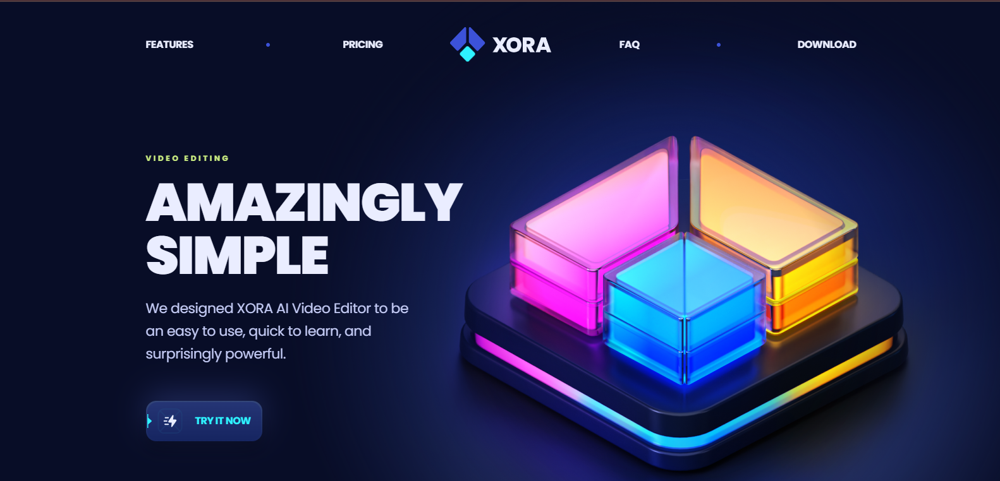
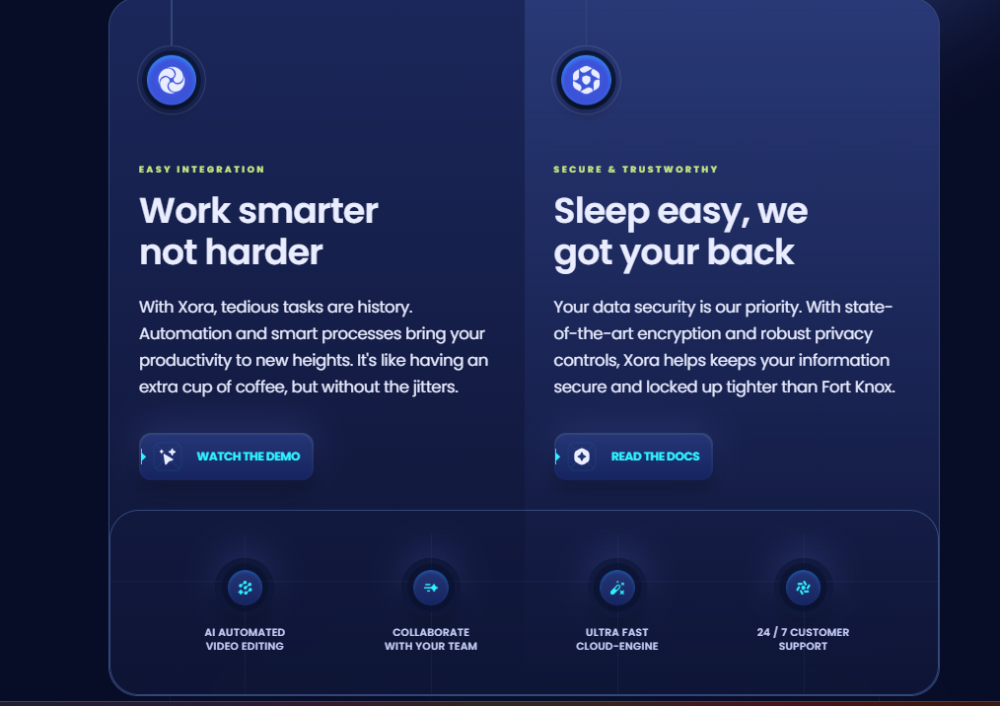

# SaaS Landing Page

A modern and fully responsive SaaS landing page built using React, Vite, and Tailwind CSS.

## 🚀 Live Preview
https://xoralanding.netlify.app/

## 🛠 Tech Stack

- React
- Vite
- Tailwind CSS
- react-scroll
- clsx

## ✨ Features

- Smooth scroll navigation
- Responsive mobile menu
- Clean and modular component structure
- Reusable UI components
- Optimized layout for different screen sizes

## 📸 Screenshots

### Hero Section


### Features Section


### Pricing Section


### FAQ Section


### Download Section


## 📦 Installation

Clone the repository:

```bash
git clone https://github.com/YOUR_USERNAME/SAAS-Landing-Page.git

```
Navigate into the folder:
```
cd SAAS-Landing-Page
```
Install dependencies:
```
npm install
```
Run the project:
```
npm run dev
```
📌 Purpose

This project was built as a frontend practice project to improve React component architecture, responsive design, and smooth navigation handling.
